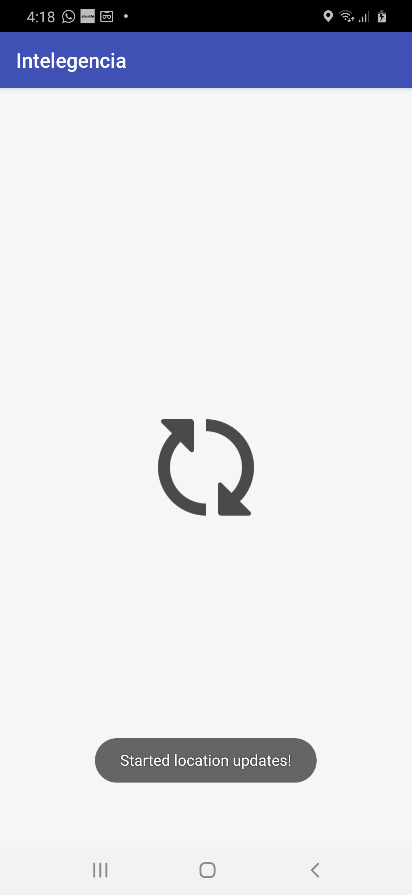
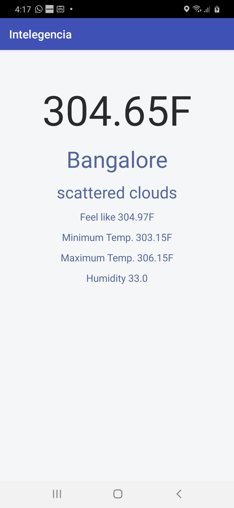

# Intelegecia - Weather App Test App V1.0.0

App is for daily weather broadcast based on user current location. With the help of http://api.openweathermap.org.

 Components Used :
 
 WorkManager for periodic request - Weather Request (Every 2 hrs)
 
 Retrofit 2 -  Network Calls
 
 Binding Libraries 
 
 Okhttp libraries
 
 Dexter runtime permission
 
 
 

